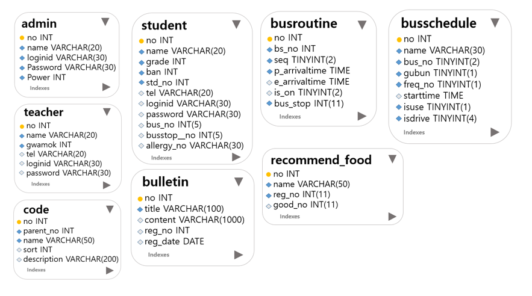
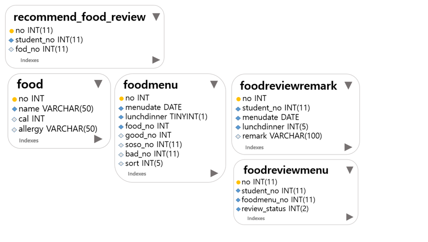

## Table
### admin
로그인 기능을 담당하고 있다.
### student
학생들의 정보를 담고있다.
### teacher
선생님들의 정보를 담고있다.
### code
선생님과 학생들의 정보, 코드를 관리한다.
### bulletin
버스기사님들이 올리는 공지사항 내용을 담고있다.
### busroutine
버스의 출발시간과 도착시간을 나타낸다.
### busschedule
버스의 도착예정시간을 나타내준다.
### recommend_food
학생들이 추천한 음식메뉴 정보와 그에 따른 선호도를 나타낸다.
### recommend_food_review
각 학생들이 했던 추천 메뉴에 대한 선호도 조사를 보여준다.
### food
음식들의 이름과 알러지 정보와 같은 식품정보를 나타낸다.
### foodmenu
날짜별로 중식, 석식 메뉴를 나타내고 그에 대한 선호도를 평가한다.
### foodreviewremark
각 학생들이 했던 메뉴에 대한 선호도 조사를 보여준다.
### foodreviewmenu
학생들이 그날 먹은 급식에 대한 한줄 평가를 남기고 그 내용을 저장한다.
